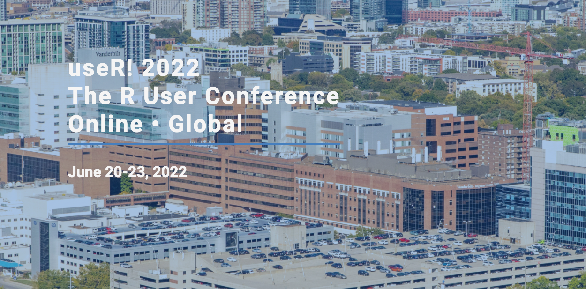
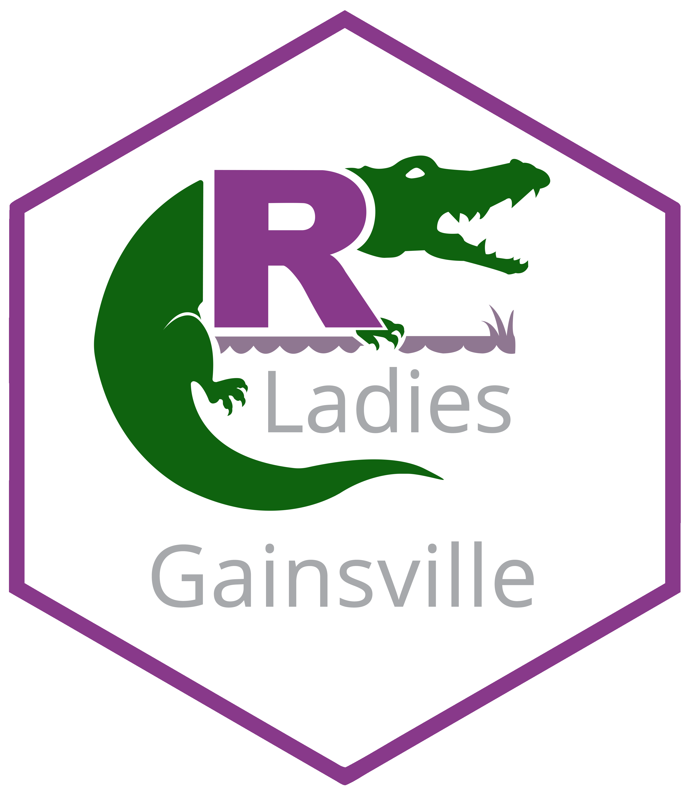

class: inverse, center
background-image: url(learnr_files/RladiesGNVLogo.png)
background-size: 100px
background-position: 10% 90%

# Creating and Sharing R Tutorials

## Welcome to R-Ladies Gainesville!

### While we're waiting to start, what R tutorials have you found useful? Put the link in the chat.

.footnote[ Note: This meeting will be recorded. Please turn off your video and edit your name (e.g., to R-Ladies Member) if you do not wish to be recorded.]

---

.pull-left[]

.pull-right[###Worldwide organization that promotes **diversity** in the **#rstats** community via meetups and mentorhsip in a **friendly** and **safe** environment.

###Our mission:

More women/non-binary
* coders
* developers
* speakers
* leaders

More awesome people developing R packages and being part of the R community.]

---
# useR! 2022 Conference

.pull-left[

Virtual conference for R users and developers. 

**Important Dates**
- Tutorials (2-3 hr, $500 payment): Feb 22
- Abstracts (talk/panel/poster): March 1
- Early registration: March 1-April 30
- Regular registration: May 1-June 20
- Conference: June 20-23

<https://user2022.r-project.org/>

]

.pull-right[]

---
class: center, middle
background-image: url(learnr-files/pawel-czerwinski-KjujL_Avm_8-unsplash.jpg)
background-size: cover

# Introductions

**Name**

**Pronouns**

**How do you use or plan to use R?**

.footnote[Photo by <a href="https://unsplash.com/@pawel_czerwinski?utm_source=unsplash&utm_medium=referral&utm_content=creditCopyText">Pawel Czerwinski</a> on <a href="https://unsplash.com/?utm_source=unsplash&utm_medium=referral&utm_content=creditCopyText">Unsplash</a>]

---

# What makes a good R tutorial?

An R tutorial can come in many forms -- a blog post, a package vignette, a formal course, etc. 

In your breakout group,
* What R tutorials have you found useful?
  + Share links!
* What characteristics make them accessible?
  + Identify **3** to share with the larger group.

---

# What makes a good R tutorial?

### Resources

* Curriculum Development Guide from The Carpentries
  + <https://carpentries.github.io/curriculum-development/>
  + Who's the learner?
  + What practical skills do you want them to learn?
  + Narrative, code chunks, and exercises
  + Cognitive load
* Choosing Topics from R-Bloggers
  + <https://www.r-bloggers.com/2020/10/picking-and-researching-blog-topics-about-r-package-development/>
  + Your own work
  + Email lists and forums
  + Twitter
* Others??

---
background-image: url(learnr-files/r-mo-fPbDggoRaQA-unsplash.jpg)
background-size: cover

# Why create R tutorials?

* Learn new skills
* Build a portfolio
* Practice communication
* Productive procrastination
* Give back to the R community

.footnote[ Modified from Rebecca Barter's blog: <https://www.rebeccabarter.com/blog/2020-02-03_blogger/>. Photo by <a href="https://unsplash.com/@mooo3721?utm_source=unsplash&utm_medium=referral&utm_content=creditCopyText">R Mo</a> on <a href="https://unsplash.com/s/photos/writing?utm_source=unsplash&utm_medium=referral&utm_content=creditCopyText">Unsplash</a>]

---

# R-Ladies Gainesville Tutorial Series

#### What:
* A website of R tutorials created by our members.

--

#### Why:
* Opportunity for R-Ladies to gain the benefits of creating their own tutorials without having to maintain their own blogs.
* Central location to reference previous meetings.
* Make R-Ladies content available to everyone.

--

#### How:
* Sign up for an R-Ladies Gainesville meeting
* Use the Tutorial Template (or another method) to create your tutorial
* Share your tutorial at a meeting to get feedback
  + Review other members' tutorials
* Post your tutorial on the R-Ladies Gainesville website

---

.pull-left[

# Tutorial Template

## Contents

**Editing the template**

**Examples**

**> Dataset**

**> Code**

**> Information for reproducibility**

**Sharing your tutorial**
]

.pull-right[
```{r echo = F}
knitr::include_graphics(c("learnr-files/RMarkdownScreenshot.png", "learnr-files/MarkdownScreenshot.png"))
```
]

---

# Editing the template

Website: <https://github.com/R-Ladies-Gainesville/tutorials>

Clone repository or download ZIP (click `Code`).

Open `tutorial_template.Rmd` in RStudio.

Edit the metadata at the top with your name.

Press `Knit` in RStudio to see the template.

.footnote[Note: The tutorial may have R code you don't recognize. Focus on the template structure, but let us know if the code inhibits you from following the template.]

---

# Examples

We want our examples to be **informative** and **reproducible**. Consider the audience, your learning objectives, and your narrative when writing examples.

Components:
- Problem or goal
- Dataset
- Solution code
- Information for reproducibility

---

# Dataset

**Create-your-own:**

```{r}
x <- c(1, 5, 9, 10)

set.seed(20)
y <- rnorm(4)
```

--

**Built-in:**

```{r}
# data() # commented out to avoid data list loading

head(iris)
```

---

# Dataset

Another great example dataset is 'penguins'
```{r}
# install the package if it's not already installed
if(!("palmerpenguins" %in% installed.packages()[,"Package"]))
  install.packages("palmerpenguins")

# load package
library(palmerpenguins)

# show data
head(penguins)
```

---

# Solution code

We will use an example from the [palmerpenguins vignette](https://allisonhorst.github.io/palmerpenguins/articles/intro.html) to demonstrate solution code. For this example, the goal is to create a scatterplot for data with different categories.

--

**Load packages** 

We use the code chunk option "message = F" to suppress messages generated when packages load.
```{r, message = F}
library(palmerpenguins)
library(dplyr)
library(ggplot2)
```

--

**Settings**

Include figure settings, saved variables, and create-your-own datasets.
```{r}
theme_set(theme_minimal())
```

---

# Solution code

**Solution**

Code to create scatterplot.
```{r, out.width = "40%", warning = F}
ggplot(data = penguins, aes(x = flipper_length_mm, y = body_mass_g)) +
  geom_point(aes(color = species, shape = species), size = 2) +
  scale_color_manual(values = c("darkorange","darkorchid","cyan4"))
```

---

# Information for reproducibility

Session information
```{r}
sessionInfo()
```

---

# Information for reproducibility

RStudio version
```{r}
rstudioapi::versionInfo()$version
```

---

# Sharing your tutorial

### R-Ladies Meeting
You're welcome to use and modify these slides. They can be found on the R-Ladies Gainesville Github: 

<https://github.com/R-Ladies-Gainesville/presentations>

You can also share your tutorial at a meeting by walking through the Markdown file.

### Github
We will use Github to share our tutorials and get feedback. We will have a tutorial on using Github!

---

# Tutorial sign-up

Tutorial presentations can be part or all of a meeting. Meeting times and days are flexible. The R-Ladies organizers are here to help you with your tutorials!

.pull-left[
### Tutorial ideas:
* Git/Github
* R Markdown presentations
* Tidyverse series
  + choose a package
* Creating a package
* Making a Shiny app
* Specific data wrangling strategies
  + fixing missing values
  + PDF-to-table
* Making figures for publication]

.pull-right[
### In the chat:
* Name
* Email
* Topic (can be TBD)
* Month(s) available to present

We'll follow up for details
]

.footnote[Note: You can sign-up anytime on our Meetup page <https://www.meetup.com/rladies-gainesville/> under **What we're about**.]

---
class: inverse, center

# Thank you!

### Contact us at:
<gainesville@rladies.org>

[@RLadiesGNV](https://twitter.com/RLadiesGNV)

```{r echo = F, out.width = "40%"}

```

.footnote[ 
This presentation is created with the [xaringan](https://slides.yihui.org/xaringan/#1) package and the RLadies theme by [Alison Hill](https://www.apreshill.com/project/rladies-xaringan/)
]